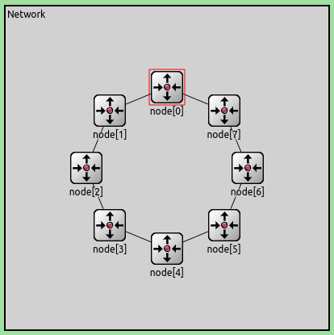
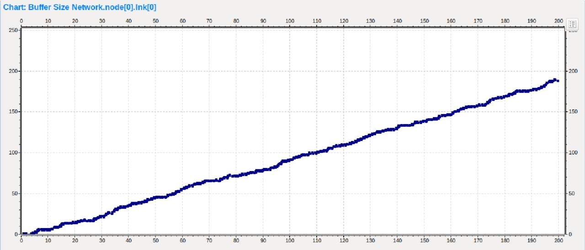
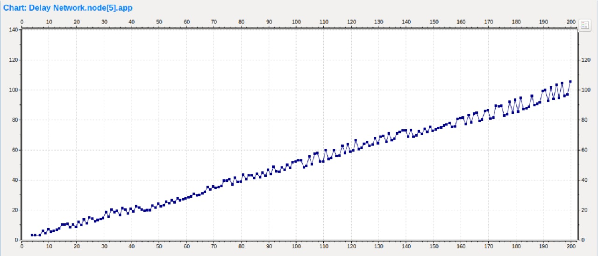
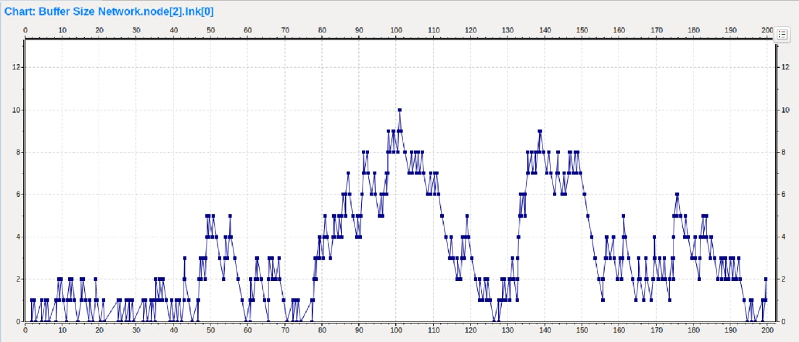
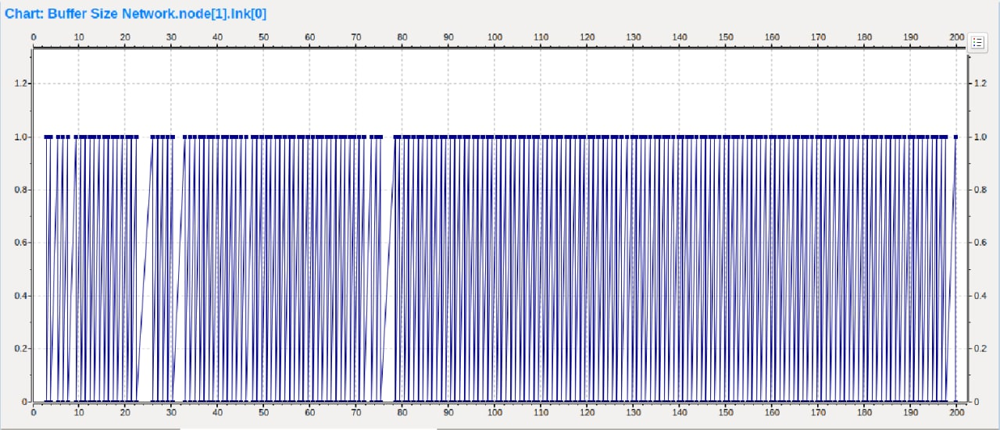
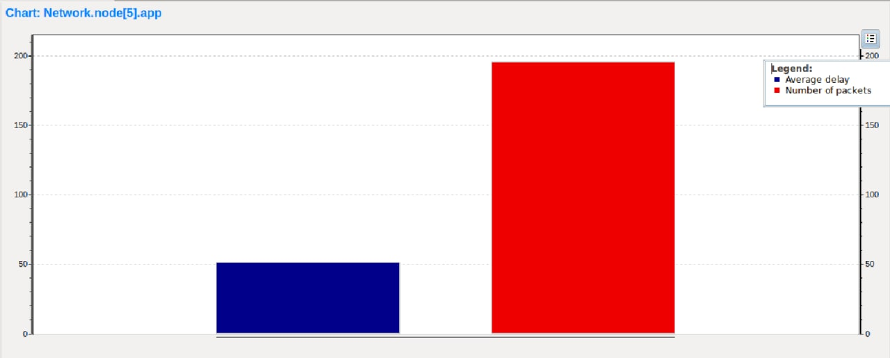
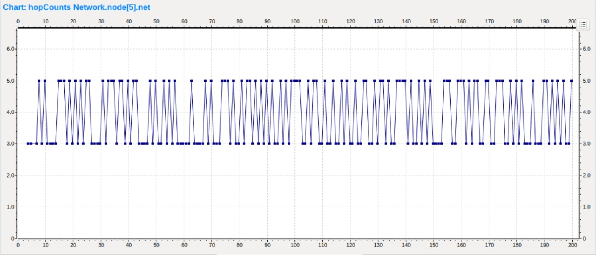

# Laboratorio 4

## Introducción

## Modelo de Anillo

`Se entrega como kickstarter un modelo de red en anillo que consta de 8 nodos, cada uno con dos interfaces de comunicación full-duplex con dos posibles vecinos`

`Internamente, cada nodo cuenta con dos capas de enlace(link olnk, una con cada vecino),una capa de red (net) y una capa de aplicación (app).`

`La capa de aplicación y la capa deenlace implementan generadores de tráfico y buffers respectivamente.`

`Cada paquete que ésta recibe es evaluado para determinar si el nodo local es el destino final del mismo. En caso de que lo sea, el paquete es enviado a la capa de aplicación local. En caso de que el paquete esté destinado a otro nodo se elige una interface para re-transmitirlo.`

`La capa de red del kickstarter elige siempre la interfacenúmero 0 (toLnk[0]) que es la que envía el tráfico en sentido de las manecillas del reloj a lo largo del anillo hasta llegar al destino.`

## Tarea análisis

### Caso 1

`Se deberá correr el modelo con las fuentes de tráfico configuradas (​node[0]​ y`
`node[2]​ transmitiendo datos a ​node[5]​) y estudiar las métricas tomadas.`

- Acá podemos ver que se genera congestion en el buffer del nodo 0,
ya que este buffer recibe constantemente paquetes tanto de su capa de aplicación como de los generados por el buffer 2.
- En cambio los demas buffers reciben los paquetes a la misma velocidad que los despachan.

- Por lo dicho anteriormente la demora en llegar al nodo de destino 5 será cada vez mayor.

- Este buffer tendrá cambios ya que la velocidad con que la capa de aplicación genera paquetes es exponencial, mientras que la velocidad a la que los despacha es constante.

- Los buffer de los nodos 1, 6 y 7 estarán siempre oscilando entre 0 y 1, ya que la velocidad con que los reciben y despachan es constante.

- Aqui podemos ver el promedio de delay de llegadas de paquetes al nodo destino, aprox 50s, y la cantidad de paquetes que llegaron, aprox 196.

- En este gráfico podemos ver que el contador de saltos entre nodos oscila entre 3 y 5.
- Esto se debe a que al generarse desde el nodo 2 tenemos 5 saltos de nodos en el camino hasta el nodo de destino 5. Y al generarse desde el nodo 0 tenemos 3 saltos entre nodos hasta el nodo de destino 5.

### `Uso de los recursos de la red`

Observando las métricas obtenidas anteriormente, los nodos 3 y 4 están siempre en desuso, por lo que hay un desperdicio de los recursos de la red.

### ¿Se puede mejorar?

Una buena mejora sería que se envíen los datos hacias las dos salidas que tiene cada nodo.
- Una opcion sencilla sería enviar un paquete a cada salida.
- Otra es que se elija la salida de forma aleatoria.

